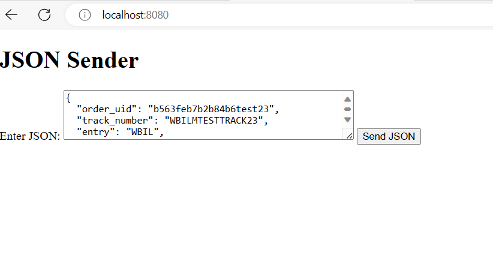
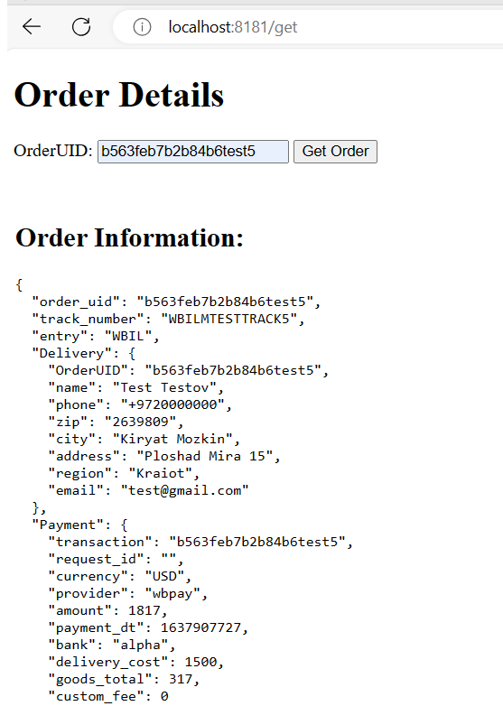

## Prerequisites

**Installed:**
- Docker
- Go

**Check:**
- Ports 8080, 8181, 4222, 8222, 5432 are free

## How to run

Create DB and add tables using tables_creation.sql (the schema is visualized in DB_schema.jpg)

**STAN:**
```bash
docker run --rm -p 4222:4222 -p 8222:8222 nats-streaming -p 4222 -m 8222
```
**Publisher:**

```bash
cd HttpPublisher
go run github.com/AnSunn/WBTasks/L0/HttpPublisher
```
**Service:**

```bash
cd StanSubscriber
go run github.com/AnSunn/WBTasks/L0/StanSubscriber
```

## UI:

**UI of Publisher**

Here you can publish the order.

_How to?_

Add JSON to publish the order, then press "Send JSON" button



**UI get order by id**

Here you can find order details by OrderUID

_How to?_

Enter OrderUID, then press "Get Order" button

